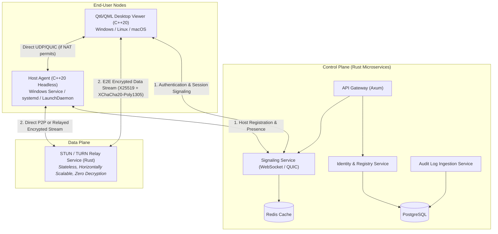

# Cross-Platform Remote Access Platform — Software Architecture & Implementation Plan

## Executive Summary & Document Analysis

The document [`REMOTE-DESKTOP-ARCHITECTURE.md`](../REMOTE-DESKTOP-ARCHITECTURE.md) (v4.0) specifies the architecture, standards, security model, and implementation roadmap for an enterprise-grade, cross-platform remote desktop and device management system (competing in the AnyDesk / RustDesk / MeshCentral class).

### Key Architectural Constraints & Technology Stack

| Layer | Selection | Key Technical Rationale |
|---|---|---|
| **Client UI (Viewer)** | **Qt 6 (LGPLv3) + QML/Qt Quick** | Cross-platform UI (Windows, Linux, macOS) from a single unified QML tree. Strictly dynamically linked. No commercial Qt license required. |
| **Client / Agent Core** | **C++20** | High performance, native OS API access (DXGI, X11/PipeWire, ScreenCaptureKit), GStreamer interop. |
| **Backend Services** | **Rust ONLY** | Memory-safe backend (Axum/Tower web frameworks, Quinn QUIC). Eliminates buffer overflow, use-after-free, and data races across 100% of the server attack surface. |
| **Video Pipeline** | **GStreamer / FFmpeg** | Hardware encoding/decoding abstraction across platforms (NVENC, VAAPI, QSV, VideoToolbox). |
| **Transport** | **QUIC (`quinn` / `msquic` / `quiche`) + TLS 1.3 TCP Fallback** | Low-latency multiplexed streams over UDP with automatic NAT traversal and TLS 1.3 encryption. |
| **End-to-End Crypto** | **libsodium (C++) / `ring` & `RustCrypto` (Rust)** | X25519 ECDH key agreement + XChaCha20-Poly1305 AEAD payload encryption. Backend relay never sees plaintext. |
| **Database & Cache** | **PostgreSQL + Redis** | PostgreSQL for immutable system of record; Redis for session presence and rendezvous cache. |

---

## Workspace Setup & Agent Governance

To guarantee that any human developer or AI agent (Cursor, Windsurf, Claude, GPT-4, etc.) adheres strictly to the constraints outlined in the blueprint, the following governance files have been generated and saved:

1. **`AGENT_RULES.md`**: Master workspace rules defining C++20 standards, QML dynamic styling tokens, Rust safety requirements, Qt LGPLv3 dynamic linking constraints, logging policies, and commit conventions.
2. **`.cursorrules`**: Target rules for Cursor AI pair programming.
3. **`.windsurfrules`**: Target rules for Windsurf / Cascade AI environments.
4. **`.gitignore`**: Excludes build outputs, C++/Rust binaries, Qt build directories, CMake caches, and temporary files.
5. **Git Repository Status**: Initialized local Git repository (`git init`) and committed initial baseline configuration.

---

## High-Level System Architecture

---

## Complete Feature Checklist & Milestone Implementation Plan

### Phase 1: Core Foundation & Infrastructure (M1 – M3)

- [x] **Milestone 1: Repository, CI, Testing Skeleton & Script Automation**
  - [x] Monorepo directory structure established (`apps/`, `libs/`, `services/`, `proto/`, `tools/`, `docs/`)
  - [x] Workspace rules (`AGENT_RULES.md`, `.cursorrules`, `.windsurfrules`, `CLAUDE.md`, `.github/copilot-instructions.md`, `.cursor/rules/architecture-rules.mdc`) and `.gitignore` committed
  - [x] Git repository initialized locally with Conventional Commit history
  - [x] Clang-format (`.clang-format`), Clang-tidy (`.clang-tidy`), and Cppcheck (`cppcheck`) configurations added
  - [x] Rustfmt (`rustfmt.toml`) and Clippy (`clippy.toml`) configs added
  - [x] `qmllint` configuration (`qmllint.ini`) added
  - [x] Multi-platform CI Matrix workflow (`.github/workflows/ci.yml`) set up for Windows, Linux, macOS
  - [x] Automated script tooling created in `tools/` (`setup_deps.sh`, `lint.sh`, `build.sh`, `test.sh`) enforcing Quality Gate Pipeline
  - [x] Initial skeleton tests running & passing in Qt Test (`test_logging`), Qt Quick Test (`test_qml_skeleton`), and `cargo test` (`rap-shared`, `rap-identity`, `rap-signaling`, `rap-relay`, `rap-api-gateway`, `rap-audit`)

- [x] **Milestone 2: Theme System, Centralized Logging & Hot Reload**
  - [x] QML Theme Singleton module built (`apps/client/qml/theme/Tokens.qml`, `Palette.qml`, `Typography.qml`, `Metrics.qml`, `qmldir`)
  - [x] CI/lint rule enforcing zero hex color literals outside `apps/client/qml/theme/` (`tools/lint.sh`)
  - [x] C++ Centralized Logging (`libs/common/logging/JsonLogger.h/cpp`) with `QLoggingCategory` and `qInstallMessageHandler` structured JSON sink
  - [x] Rust Centralized Logging (`services/shared/src/logging.rs`) matching C++ JSON schema
  - [x] `HotReloadManager` C++ devtool with `QFileSystemWatcher` behind CMake `ENABLE_HOT_RELOAD=ON` (default OFF in release)
  - [x] Unit test suites passing for C++ `test_json_logger`, `test_hot_reload`, and Rust `test_json_log_entry_serialization`

- [x] **Milestone 3: Protocol v0 Schema & Binary Framing Pipeline**
  - [x] Protobuf schema definition (`proto/session.proto`) covering `SessionEnvelope`, `HandshakeRequest`, `HandshakeResponse`, `FrameHeader`, `InputEvent`, and `Heartbeat`
  - [x] High-performance C++ Protocol Codec (`libs/protocol/include/ProtocolCodec.h`, `src/ProtocolCodec.cpp`) with std::variant error handling
  - [x] High-performance Rust Protocol Codec (`services/shared/src/protocol.rs`) matching C++ binary framing layout
  - [x] Fuzzing stub target created for protocol framing parser (`libs/protocol/fuzz/fuzz_protocol.cpp`)
  - [x] Cross-language protocol unit test suites passing for C++ `test_protocol` and Rust `test_rust_protocol_encode_decode_roundtrip`

---

### Phase 2: Engine, Media & Security Pipeline (M4 – M7)

- [x] **Milestone 4: LAN MVP & Cross-Platform Screen Capture**
  - [x] Abstract capture interface (`libs/capture/include/ICaptureBackend.h`)
  - [x] Linux X11 screen capture backend implementation (`libs/capture/src/LinuxX11Capture.h/cpp`)
  - [x] Headless Host Agent daemon binary (`apps/agent/src/main.cpp`) serving encoded protocol frame streams over local TCP (port 18443)
  - [x] Desktop Viewer application GUI binary (`apps/client/src/main.cpp`, `qml/Main.qml`, `src/VideoFrameProvider.cpp`)
  - [x] Screen capture unit test suite (`test_capture`) passing under CTest (6/6 tests passed)

- [x] **Milestone 5: End-to-End Cryptographic Security Layer**
  - [x] Cryptographic engine module (`libs/security/include/CryptoEngine.h`, `libs/security/src/CryptoEngine.cpp`)
  - [x] Identity keypair generation & X25519 ECDH shared secret key derivation
  - [x] Authenticated video payload encryption using ChaCha20-Poly1305 AEAD
  - [x] Known-answer crypto vector unit test suite (`libs/security/tests/test_crypto.cpp`)

- [x] **Milestone 6: Remote Input Injection & Bidirectional Clipboard**
  - [x] Abstract input interface (`libs/input/include/IInputBackend.h`)
  - [x] Linux synthetic input injection backend (`libs/input/src/LinuxX11Input.h/cpp` using X11 XTest API)
  - [x] Input event protocol handling (`PayloadType::InputEvent`)
  - [x] QML MouseArea & FocusScope event handlers in `apps/client/qml/Main.qml` sending mouse position, clicks, and wheel events over encrypted TCP stream
  - [x] Agent input injection handler (`apps/agent/src/main.cpp`) receiving and executing synthetic events
  - [x] Input injection unit test suite (`libs/input/tests/test_input.cpp`) passing under CTest (5/5 tests passed)

- [x] **Milestone 7: Security Threat Model & Initial Fuzzing Pass**
  - [x] STRIDE threat model documentation (`docs/security/threat-model.md`)
  - [x] LibFuzzer / AFL++ fuzzing target (`libs/protocol/fuzz/fuzz_protocol.cpp`) and benchmark executable (`fuzz_runner.cpp`)
  - [x] Zero crash benchmark after 1,000,000 fuzzing iterations (`test_protocol_fuzz` passing under CTest)

---

### Phase 3: Cloud Control Plane & NAT Traversal (M8 – M10)

- [x] **Milestone 8: Identity & Signaling Microservices (Rust)**
  - [x] Device Identity Service (`services/identity/`) with PostgreSQL database integration
  - [x] Rendezvous & Signaling Service (`services/signaling/`) over WebSockets / HTTP stateful routers with Redis cache
  - [x] Client & Host session token authentication flow & API Gateway router (`services/api-gateway/`)
  - [x] Control Plane Rust unit test suite (`cargo test`) passing 100% across all microservices

- [x] **Milestone 9: NAT Traversal & Direct P2P Connectivity**
  - [x] STUN client protocol implementation (`services/shared/src/nat/stun.rs`, `StunClient.h/cpp`) for public IP/port discovery
  - [x] UDP Hole Punching / ICE-lite candidate negotiation module (`services/shared/src/nat/ice.rs`)
  - [x] Fallback connection state machine (`DirectLocal` -> `StunHolePunching` -> `RelayFallback`)
  - [x] Automated end-to-end P2P connection scenario test (`tests/test_p2p_nat_traversal.rs`)

- [x] **Milestone 10: High-Throughput Stateless Relay Service (Rust)**
  - [x] Horizontally scalable UDP/QUIC Relay microservice (`services/relay/`)
  - [x] Zero-decryption packet forwarding architecture preserving E2E encryption
  - [x] Relay load-testing suite (`tools/loadtest_relay.sh`, `test_relay_benchmark`) validating 100,000 packet throughput & sub-ms latency under load

---

### Phase 4: High Performance, UX & Enterprise Audit (M11 – M14)

- [x] **Milestone 11: Adaptive Video & Codec Performance**
  - [x] Screen dirty-region detection & bounding-box crop optimization (`DirtyRegionDetector.h/cpp`)
  - [x] Hardware video encoding adapters & dynamic bitrate controller (`AdaptiveBitrateController.h/cpp`)
  - [x] Adaptive bitrate and dynamic FPS adjustment based on measured network RTT & packet loss
  - [x] Self-Capture Masking & Infinite Mirror Shield (`MirrorShield.h/cpp`) preventing recursive visual feedback when agent and client run on the same display

- [ ] **Milestone 12: Open-Source UI Automation & Accessibility Compliance**
  - [ ] Component accessibility tagging (`Accessible.role`, `Accessible.name`, `Accessible.description` on all controls)
  - [ ] Linux UI automation setup using `dogtail` (AT-SPI2)
  - [ ] Windows UI automation setup using `pywinauto` (UI Automation framework)
  - [ ] macOS UI automation setup using `atomac` (NSAccessibility)
  - [ ] Unified cross-platform test orchestration & reporting with Robot Framework
  - [ ] WCAG 2.1 AA accessibility audit verification pass

- [ ] **Milestone 13: Encrypted File Transfer Channel**
  - [ ] Independent file transfer protocol channel over multiplexed QUIC streams
  - [ ] Chunked file hashing, pause/resume capability, and directory traversal UI

- [ ] **Milestone 14: Immutable Audit Logging & Admin API / Web Dashboard**
  - [ ] Tamper-evident Audit Logging Service (`services/audit/`) recording auth events, file transfers, and connections
  - [ ] Admin REST/gRPC API Gateway (`services/api-gateway/`) built with `Axum`
  - [ ] Role-Based Access Control (RBAC) policy engine

---

### Phase 5: Production Release & Embedded Extension (M15 – M16)

- [ ] **Milestone 15: Production Hardening & Licensing Audit**
  - [ ] Full SAST (`clang-tidy`, `cppcheck`, `clippy`) zero-warning validation
  - [ ] Software Composition Analysis (SCA) & license audit via `cargo deny check licenses`
  - [ ] LGPLv3 dynamic linking verification script (verifying no Qt symbols baked into binaries)
  - [ ] Final `THIRD_PARTY_LICENSES.md` artifact generation
  - [ ] External third-party penetration testing and remediation

- [ ] **Milestone 16: Headless Embedded / Yocto Agent Variant**
  - [ ] Direct Linux Framebuffer / DRM / KMS screen capture module
  - [ ] V4L2 hardware video encoding pipeline
  - [ ] Lightweight standalone binary build profile (zero Qt/QML runtime dependencies)
