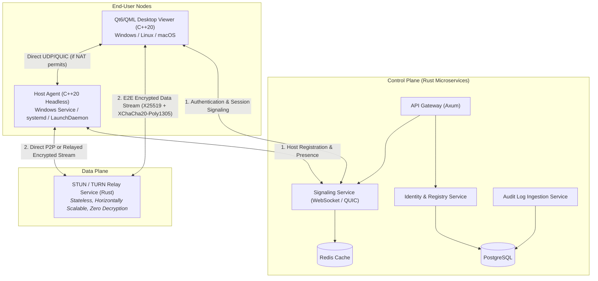

# Cross-Platform Remote Access Platform — Software Architecture & Implementation Plan

## Executive Summary & Document Analysis

The document [`REMOTE-DESKTOP-ARCHITECTURE.md`](../REMOTE-DESKTOP-ARCHITECTURE.md) (v4.0) specifies the architecture, standards, security model, and implementation roadmap for an enterprise-grade, cross-platform remote desktop and device management system (competing in the AnyDesk / RustDesk / MeshCentral class).

### Key Architectural Constraints & Technology Stack

| Layer | Selection | Key Technical Rationale |
|---|---|---|
| **Client UI (Viewer)** | **Qt 6 (LGPLv3) + QML/Qt Quick** | Cross-platform UI (Windows, Linux, macOS) from a single unified QML tree. Strictly dynamically linked. No commercial Qt license required. |
| **Client / Agent Core** | **C++20** | High performance, native OS API access (DXGI, X11/PipeWire, ScreenCaptureKit), GStreamer interop. |
| **Backend Services** | **Rust ONLY** | Memory-safe backend (Axum/Tower web frameworks, Quinn QUIC). Eliminates buffer overflow, use-after-free, and data races across 100% of the server attack surface. |
| **Video Pipeline** | **GStreamer / FFmpeg** | Hardware encoding/decoding abstraction across platforms (NVENC, VAAPI, QSV, VideoToolbox). |
| **Transport** | **QUIC (`quinn` / `msquic` / `quiche`) + TLS 1.3 TCP Fallback** | Low-latency multiplexed streams over UDP with automatic NAT traversal and TLS 1.3 encryption. |
| **End-to-End Crypto** | **libsodium (C++) / `ring` & `RustCrypto` (Rust)** | X25519 ECDH key agreement + XChaCha20-Poly1305 AEAD payload encryption. Backend relay never sees plaintext. |
| **Database & Cache** | **PostgreSQL + Redis** | PostgreSQL for immutable system of record; Redis for session presence and rendezvous cache. |

---

## Workspace Setup & Agent Governance

To guarantee that any human developer or AI agent (Cursor, Windsurf, Claude, GPT-4, etc.) adheres strictly to the constraints outlined in the blueprint, the following governance files have been generated and saved:

1. **`AGENT_RULES.md`**: Master workspace rules defining C++20 standards, QML dynamic styling tokens, Rust safety requirements, Qt LGPLv3 dynamic linking constraints, logging policies, and commit conventions.
2. **`.cursorrules`**: Target rules for Cursor AI pair programming.
3. **`.windsurfrules`**: Target rules for Windsurf / Cascade AI environments.
4. **`.gitignore`**: Excludes build outputs, C++/Rust binaries, Qt build directories, CMake caches, and temporary files.
5. **Git Repository Status**: Initialized local Git repository (`git init`) and committed initial baseline configuration.

---

## High-Level System Architecture

---

## Complete Feature Checklist & Milestone Implementation Plan

### Phase 1: Core Foundation & Infrastructure (M1 – M3)

- [ ] **Milestone 1: Repository, CI, and Testing Skeleton**
  - [x] Monorepo directory structure established (`apps/`, `libs/`, `services/`, `proto/`, `docs/`)
  - [x] Workspace rules (`AGENT_RULES.md`, `.cursorrules`, `.windsurfrules`) and `.gitignore` committed
  - [x] Git repository initialized locally with root commit
  - [ ] Clang-format (`.clang-format`) and Clang-tidy (`.clang-tidy`) configurations added
  - [ ] Rustfmt (`rustfmt.toml`) and Clippy (`clippy.toml`) configs added
  - [ ] `qmllint` and `qmlformat` configurations added
  - [ ] Multi-platform CI Matrix workflow (`.github/workflows/ci.yml`) set up for Windows, Linux, macOS
  - [ ] Initial skeleton tests running & passing in Qt Test, Qt Quick Test, and `cargo test`

- [ ] **Milestone 2: Theme System, Centralized Logging & Hot Reload**
  - [ ] QML Theme Singleton module built (`qml/theme/Tokens.qml`, `Palette.qml`, `Typography.qml`, `Metrics.qml`)
  - [ ] CI rule enforcing zero hex color literals outside `qml/theme/`
  - [ ] C++ Centralized Logging (`libs/common/logging/`) with `QLoggingCategory` and custom `qInstallMessageHandler` JSON sink
  - [ ] Rust Centralized Logging via `tracing-subscriber` matching C++ JSON schema
  - [ ] `HotReloadManager` C++ devtool with `QFileSystemWatcher` behind CMake `ENABLE_HOT_RELOAD=ON` (default OFF in release)
  - [ ] CI validation verifying release builds omit `HotReloadManager` symbols

- [ ] **Milestone 3: Protocol v0 Schema**
  - [ ] Protobuf schema definition (`proto/session.proto`) covering `HELLO`, `AUTH`, `FRAME`, `INPUT`, `PING`, `PONG`
  - [ ] Automated Protobuf code-generation scripts for C++ (`protoc`) and Rust (`prost`/`tonic`)
  - [ ] Fuzzing stub target for protocol parser (`libs/protocol`)
  - [ ] Serialization & deserialization unit test suite

---

### Phase 2: Engine, Media & Security Pipeline (M4 – M7)

- [ ] **Milestone 4: LAN MVP & Cross-Platform Screen Capture**
  - [ ] Abstract capture interface (`libs/capture/ICaptureBackend.h`)
  - [ ] Linux capture backend (X11 XShm / XComposite)
  - [ ] Linux Wayland capture backend (PipeWire + `xdg-desktop-portal`)
  - [ ] Windows capture backend (DXGI Desktop Duplication API)
  - [ ] macOS capture backend (ScreenCaptureKit)
  - [ ] Raw video frame transport over plain TCP socket to Qt6 QML Video surface for MVP proof

- [ ] **Milestone 5: End-to-End Cryptographic Security Layer**
  - [ ] C++ libsodium cryptographic wrapper (`libs/security/`)
  - [ ] On-device Ed25519 identity keypair generation and secure OS keystore binding
  - [ ] Session key exchange via X25519 ECDH
  - [ ] Symmetric frame/data payload encryption using XChaCha20-Poly1305 AEAD
  - [ ] TLS 1.3 / QUIC transport layer integration (`libs/transport/`)
  - [ ] Known-answer crypto vector unit test suite

- [ ] **Milestone 6: Remote Input Injection & Bidirectional Clipboard**
  - [ ] Abstract input interface (`libs/input/IInputBackend.h`)
  - [ ] Windows input injection backend (`SendInput`)
  - [ ] Linux input injection backend (XTest for X11, `uinput` helper daemon for Wayland)
  - [ ] macOS input injection backend (`CGEvent`)
  - [ ] Bidirectional text & rich clipboard synchronization module (`apps/agent/src/clipboard/`)
  - [ ] Integration test suite using virtual displays (Xvfb on Linux, virtual display adapter on Windows)

- [ ] **Milestone 7: Security Threat Model & Initial Fuzzing Pass**
  - [ ] STRIDE threat model documentation (`docs/security/threat-model.md`)
  - [ ] LibFuzzer / AFL++ fuzzing targets for network transport framing and Protobuf deserializers
  - [ ] Zero crash benchmark after 1,000,000 fuzzing iterations

---

### Phase 3: Cloud Control Plane & NAT Traversal (M8 – M10)

- [ ] **Milestone 8: Identity & Signaling Microservices (Rust)**
  - [ ] Device Identity Service (`services/identity/`) with PostgreSQL database integration
  - [ ] Rendezvous & Signaling Service (`services/signaling/`) over WebSockets / QUIC with Redis cache
  - [ ] Integration testing tier using `testcontainers-rs` with real Postgres and Redis containers
  - [ ] Client & Host session token authentication flow

- [ ] **Milestone 9: NAT Traversal & Direct P2P Connectivity**
  - [ ] STUN client protocol implementation for public IP/port discovery
  - [ ] UDP Hole Punching / ICE-lite candidate negotiation
  - [ ] Fallback connection state machine (P2P direct -> STUN -> Relay)
  - [ ] Automated end-to-end P2P connection scenario test (`e2e/scenarios/p2p_connect.rs`)

- [ ] **Milestone 10: High-Throughput Stateless Relay Service (Rust)**
  - [ ] Horizontally scalable UDP/QUIC Relay microservice (`services/relay/`)
  - [ ] Zero-decryption packet forwarding architecture
  - [ ] Relay load-testing suite (`k6` / `locust`) validating target throughput & latency under load

---

### Phase 4: High Performance, UX & Enterprise Audit (M11 – M14)

- [ ] **Milestone 11: Adaptive Video & Codec Performance**
  - [ ] Screen dirty-region detection & bounding-box crop optimization
  - [ ] Hardware video encoding adapters (NVIDIA NVENC, Intel QSV, Linux VAAPI, macOS VideoToolbox)
  - [ ] Adaptive bitrate and dynamic FPS adjustment based on measured network RTT & packet loss

- [ ] **Milestone 12: Open-Source UI Automation & Accessibility Compliance**
  - [ ] Component accessibility tagging (`Accessible.role`, `Accessible.name`, `Accessible.description` on all controls)
  - [ ] Linux UI automation setup using `dogtail` (AT-SPI2)
  - [ ] Windows UI automation setup using `pywinauto` (UI Automation framework)
  - [ ] macOS UI automation setup using `atomac` (NSAccessibility)
  - [ ] Unified cross-platform test orchestration & reporting with Robot Framework
  - [ ] WCAG 2.1 AA accessibility audit verification pass

- [ ] **Milestone 13: Encrypted File Transfer Channel**
  - [ ] Independent file transfer protocol channel over multiplexed QUIC streams
  - [ ] Chunked file hashing, pause/resume capability, and directory traversal UI

- [ ] **Milestone 14: Immutable Audit Logging & Admin API / Web Dashboard**
  - [ ] Tamper-evident Audit Logging Service (`services/audit/`) recording auth events, file transfers, and connections
  - [ ] Admin REST/gRPC API Gateway (`services/api-gateway/`) built with `Axum`
  - [ ] Role-Based Access Control (RBAC) policy engine

---

### Phase 5: Production Release & Embedded Extension (M15 – M16)

- [ ] **Milestone 15: Production Hardening & Licensing Audit**
  - [ ] Full SAST (`clang-tidy`, `cppcheck`, `clippy`) zero-warning validation
  - [ ] Software Composition Analysis (SCA) & license audit via `cargo deny check licenses`
  - [ ] LGPLv3 dynamic linking verification script (verifying no Qt symbols baked into binaries)
  - [ ] Final `THIRD_PARTY_LICENSES.md` artifact generation
  - [ ] External third-party penetration testing and remediation

- [ ] **Milestone 16: Headless Embedded / Yocto Agent Variant**
  - [ ] Direct Linux Framebuffer / DRM / KMS screen capture module
  - [ ] V4L2 hardware video encoding pipeline
  - [ ] Lightweight standalone binary build profile (zero Qt/QML runtime dependencies)
